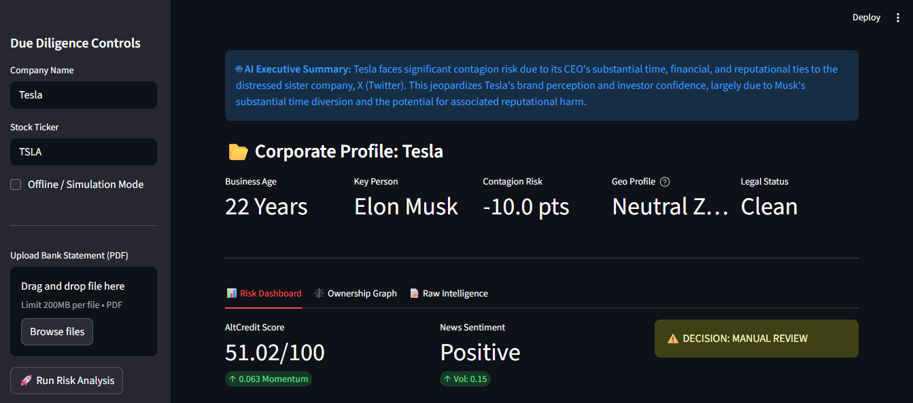
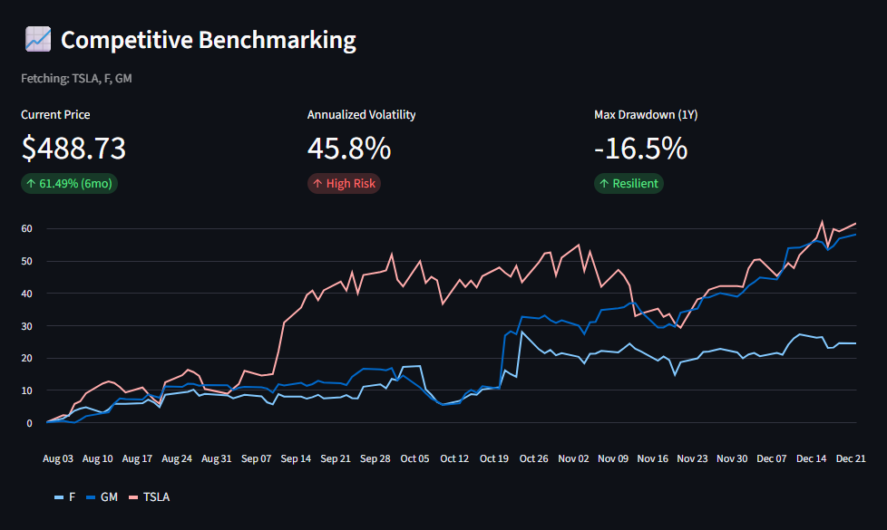
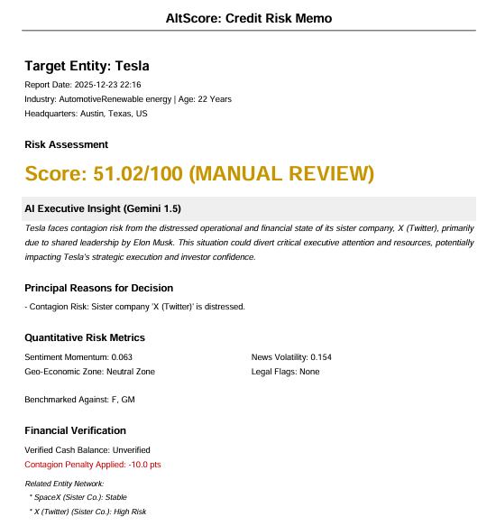

# CredIQ  
<div align="center">

<h2>AI-Powered Credit Risk & Corporate Due Diligence Engine</h2>

<br/>


</div>

---

## 📌 Overview

**CredIQ** is an enterprise-grade **credit risk assessment and corporate due-diligence platform** inspired by modern fintech and institutional banking systems.

It combines **deterministic financial modeling**, **real-time market intelligence**, and **Generative AI** to deliver **transparent, explainable, and regulator-friendly** credit decisions.

---

## ✨ Core Capabilities

### 🧮 1. Deterministic Credit Risk Engine
A rule-based weighting engine (`RiskEvaluator`) computes a **Credit Score (0–100)** using:

- **Sentiment Momentum**  
  Measures directional change in public sentiment over time.

- **News Volume Volatility**  
  High fluctuation signals reputational or operational instability.

- **Geo-Economic Risk**  
  Penalizes companies based on macro and regional risk exposure.

- **Legal & Regulatory Flags**  
  Binary penalties for lawsuits, investigations, or compliance breaches.

>  Fully explainable scoring — every number has a reason.

---

### 🤖 2. Generative AI Analyst (Google Gemini)
Powered by **Google Gemini 1.5 Flash**, CredIQ simulates a **Senior Credit Analyst**:

- **AI Risk Summary**  
  Generates concise, board-ready executive opinions.

- **Dynamic Peer Discovery**  
  Identifies comparable companies automatically  
  *(e.g., Tesla → Ford, GM)* 

---

### 📈 3. Competitive Stock Benchmarking
- **Real-Time Market Data** (Alpha Vantage)
- **Performance Normalization** (rebased to 0%)
- **6-Month Metrics**
  - Annualized Volatility
  - Maximum Drawdown (Crash Risk)
  - Total Returns

> Enables fast relative-risk benchmarking.

---

### 🕸️ 4. Contagion Graph & Network Risk
- **Ownership & Relationship Mapping** using Graphviz
- **Contagion Detection**
  - Flags connected entities with score < 50
  - Visualizes toxic exposure paths using red dashed edges

> Mirrors real-world **credit contagion analysis** used by banks.

---

### 📰 5. Live News & Sentiment Analysis
- **Custom Web Scraper** (`ReviewScraper`)
- **NLP Processing** with TextBlob
- Extracts:
  - News headlines
  - Business metadata
  - Sentiment polarity & trends

> Simulates continuous due-diligence monitoring.

---

### 📄 6. Financial Document OCR & Verification
- **PDF Parsing** via `pdfplumber`
- **Automated Validation**
  - Detects keywords like *Ending Balance*, *Total Assets*
  - Overrides estimates with verified financial proof

>  Adds documentary evidence to risk decisions.

---

### 🔐 7. Enterprise Architecture & Security
- **Authentication Gatekeeper**
  - Session-based login system  
  - Default credentials: `admin`

- **Session Persistence**
  - Uses `st.session_state` to avoid data loss

- **High-Performance Caching**
  - `@st.cache_data` reduces repeat API latency by ~90%

---

### 📑 8. Automated Reporting & Exports
- **PDF Credit Memo**
  - Banking-style reports with charts, AI insights, and verified data

- **Excel Data Export**
  - Raw datasets, peer lists, sentiment logs
  - For audit, quant, and compliance teams

---

## 📸 Project Gallery

### 1. AI-Powered Risk Dashboard
*Real-time risk scoring, AI executive summaries, and sentiment analysis.*



---

### 2. Network & Market Analysis
*Interactive ownership contagion graphs and competitive stock benchmarking.*



---

### 3. Automated Credit Memo (PDF)
*Banking-standard export with verified financials and AI insights.*



---

## 🧠 Technical Architecture

### 🛠️ Tech Stack
- **Frontend:** Streamlit  
- **AI / LLM:** Google Gemini API  
- **Market Data:** Alpha Vantage  
- **Visualization:** Matplotlib, Graphviz  
- **Data Processing:** Pandas, NumPy, TextBlob, pdfplumber  
- **Reporting:** FPDF, OpenPyXL  

---

## ⚡ Quick Start Guide

### 1️⃣ Installation
```bash
git clone https://github.com/Vaishnavi-Venkataraman/CredIQ.git
cd CredIQ
pip install -r requirements.txt
````

---

### 2️⃣ Configuration

Add API keys either in `dashboard.py` or as environment variables:

* **Google Gemini API Key** – AI summaries & peer discovery
* **Alpha Vantage API Key** – Market & stock data

---

### 3️⃣ Run the Application

```bash
streamlit run dashboard.py
```

---

### 4️⃣ Access

* **URL:** [http://localhost:8501](http://localhost:8501)
* **Default Password:** `admin`

---

## 🔮 Roadmap

* 🧾 **SME Risk Analyzer**
  Lightweight credit scoring engine for small enterprises using alternative data

* 🔗 **Neo4j Integration**
  Persistent graph storage for deep ownership and exposure analysis

* 📰 **Live News Feed**
  Continuous sentiment refresh with alerts

* 📊 **Stress Testing Engine**
  Scenario-based macroeconomic and liquidity shock simulations

* 🐳 **Dockerization**
  One-command containerized deployment

---
